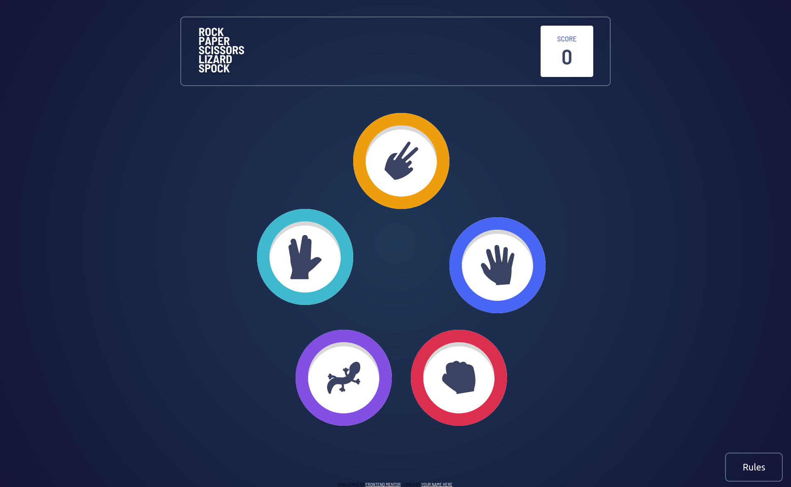
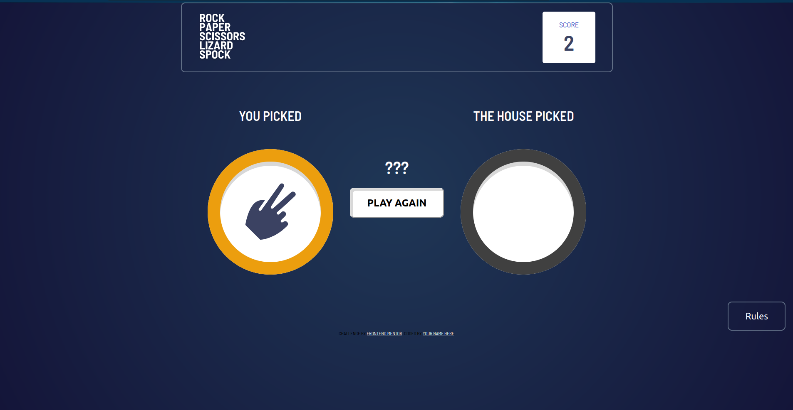
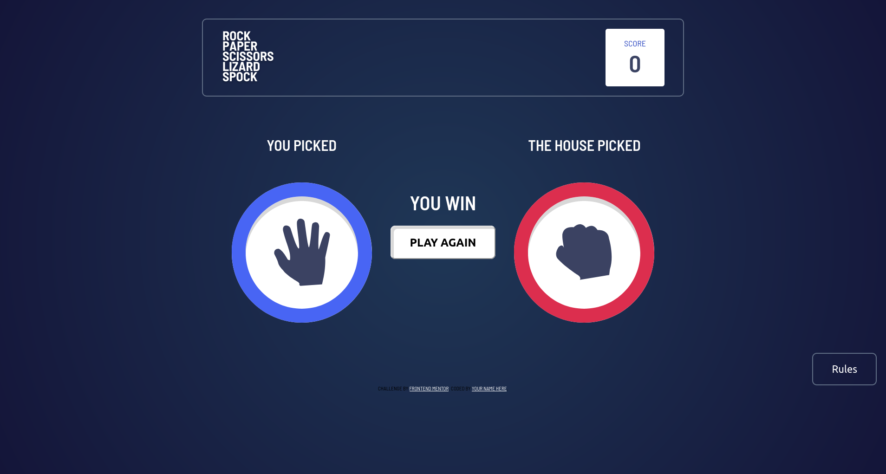
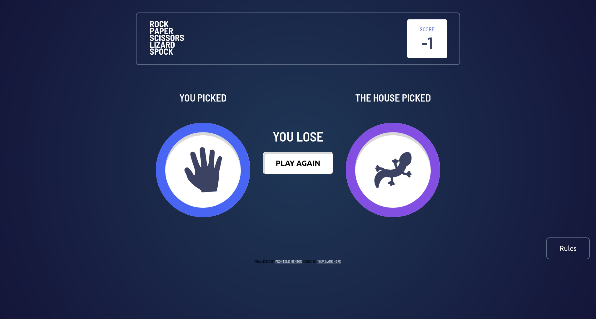

# Rock Paper Scissor Lizard Spock | Pedra Papel Tesoura Lagarto Spock

[English Translation](#english)

[Imagens / Images](#images)

## Sobre

- **Nome Projecto**: Pedra Papel Tesoura Lagarto Spock
- **Data / Período de Criação**: 27/08/2021
- **Motivo**: Necessidade de Melhorar minhas habilidades quanto front-end developer.
- **Objectivo**: Reconstruir o famoso jogo pedra papel tesoura, mas com coisas adicionais.
- **Tecnologias Usadas**: `HTML`, `CSS`, `JS`.
- **Link de Acesso**: [click here](https://www.eufraniodiogo.github.io/rock-paper-scissor-lizard-spock)
- **Autor / Autores**: Eufránio Diogo

<h2 id="english">About</h2>

- **Project Name**: Rock Paper Scissor Lizard Spock
- **Date / Creation Time**: 27/08/2021
- **Why**: Necessity to push up my skills as front-end developer.
- **Goals**: Rebuild the famous game rock paper scissor, but with more additional stuff.
- **Used Tecs**: `HTML`, `CSS`, `JS`
- **Access Link**: [click here](https://www.eufraniodiogo.github.io/rock-paper-scissor-lizard-spock)
- **Author(s)**: Eufránio Diogo

<h2 id="images">Imagens / Images</h2>

## Source of Ideia / Origem da Ideia?
[frontendmentor.io](https://www.frontendmentor.io)
